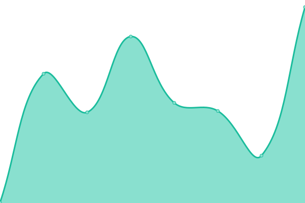
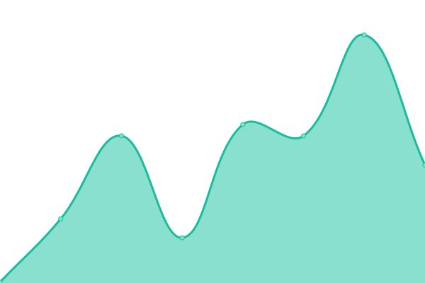
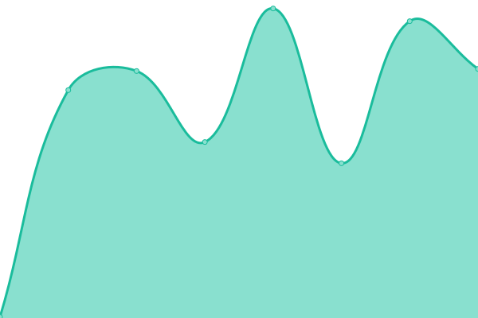

# [📈 Live Status](https://status.samasaur.com): <!--live status--> **🟩 All systems operational**

This repository contains the open-source uptime monitor and status page for [Sam](https://status.samasaur.com), powered by [Upptime](https://github.com/upptime/upptime).

With [Upptime](https://upptime.js.org), you can get your own unlimited and free uptime monitor and status page, powered entirely by a GitHub repository. We use [Issues](https://github.com/Samasaur1/upptime/issues) as incident reports, [Actions](https://github.com/Samasaur1/upptime/actions) as uptime monitors, and [Pages](https://status.samasaur.com) for the status page.

<!--start: status pages-->
<!-- This summary is generated by Upptime (https://github.com/upptime/upptime) -->
<!-- Do not edit this manually, your changes will be overwritten -->
<!-- prettier-ignore -->
| URL | Status | History | Response Time | Uptime |
| --- | ------ | ------- | ------------- | ------ |
|  [samasaur.com](https://samasaur.com) | 🟩 Up | [samasaur-com.yml](https://github.com/Samasaur1/upptime/commits/HEAD/history/samasaur-com.yml) | 

 193ms
     
 | 

<a href="https://status.samasaur.com/history/samasaur-com">100.00%</a>
    

|  [Vaultwarden instance](https://vault.samasaur.com) | 🟩 Up | [vaultwarden-instance.yml](https://github.com/Samasaur1/upptime/commits/HEAD/history/vaultwarden-instance.yml) | 

 270ms
     
 | 

<a href="https://status.samasaur.com/history/vaultwarden-instance">100.00%</a>
    

|  [Media server](https://watch.samasaur.com) | 🟩 Up | [media-server.yml](https://github.com/Samasaur1/upptime/commits/HEAD/history/media-server.yml) | 

 600ms
     
 | 

<a href="https://status.samasaur.com/history/media-server">100.00%</a>
    

|  [Blog](https://samasaur1.github.io) | 🟩 Up | [blog.yml](https://github.com/Samasaur1/upptime/commits/HEAD/history/blog.yml) | 

 62ms
     
 | 

<a href="https://status.samasaur.com/history/blog">100.00%</a>
    

|  [Status page (this site)](https://status.samasaur.com) | 🟩 Up | [status-page-this-site.yml](https://github.com/Samasaur1/upptime/commits/HEAD/history/status-page-this-site.yml) | 

 116ms
     
 | 

<a href="https://status.samasaur.com/history/status-page-this-site">100.00%</a>
    

|  [Factor puzzle of the day](https://factor.samasaur.com/puzzle.json) | 🟩 Up | [factor-puzzle-of-the-day.yml](https://github.com/Samasaur1/upptime/commits/HEAD/history/factor-puzzle-of-the-day.yml) | 

 185ms
     
 | 

<a href="https://status.samasaur.com/history/factor-puzzle-of-the-day">100.00%</a>
    

<!--end: status pages-->

[**Visit our status website →**](https://status.samasaur.com)

## 📄 License

- Powered by: [Upptime](https://github.com/upptime/upptime)
- Code: [MIT](./LICENSE) © [Anand Chowdhary](https://anandchowdhary.com), supported by [Pabio](https://pabio.com)
- Data in the `./history` directory: [Open Database License](https://opendatacommons.org/licenses/odbl/1-0/)
